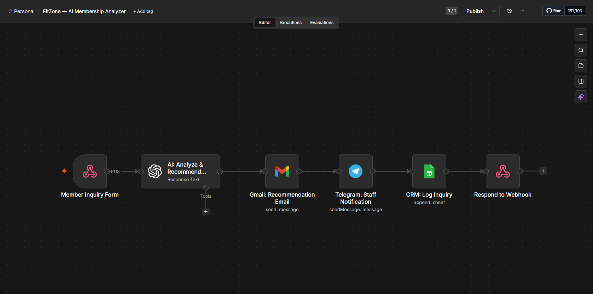
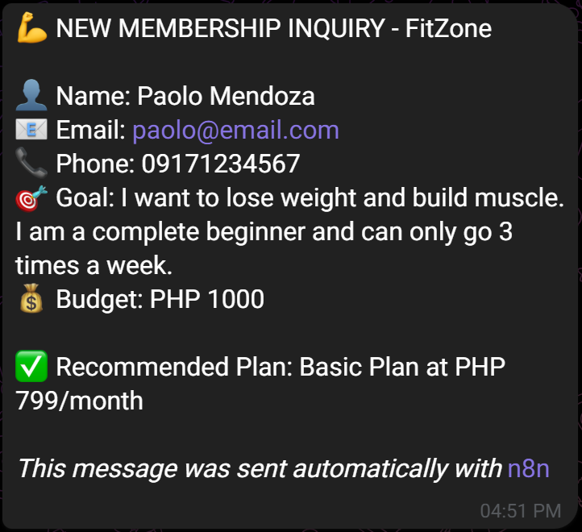
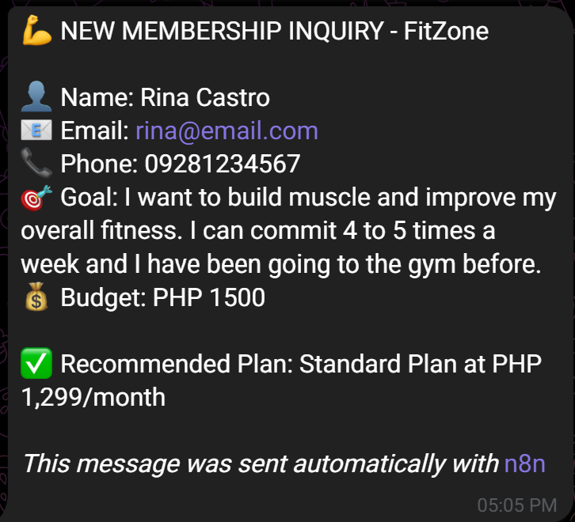
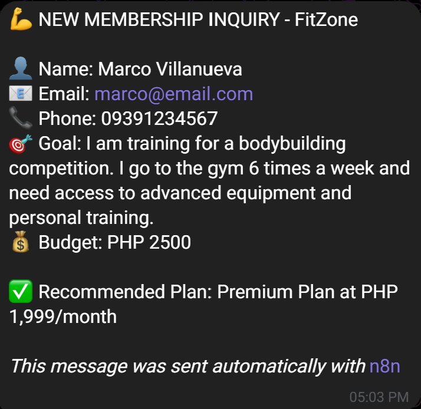
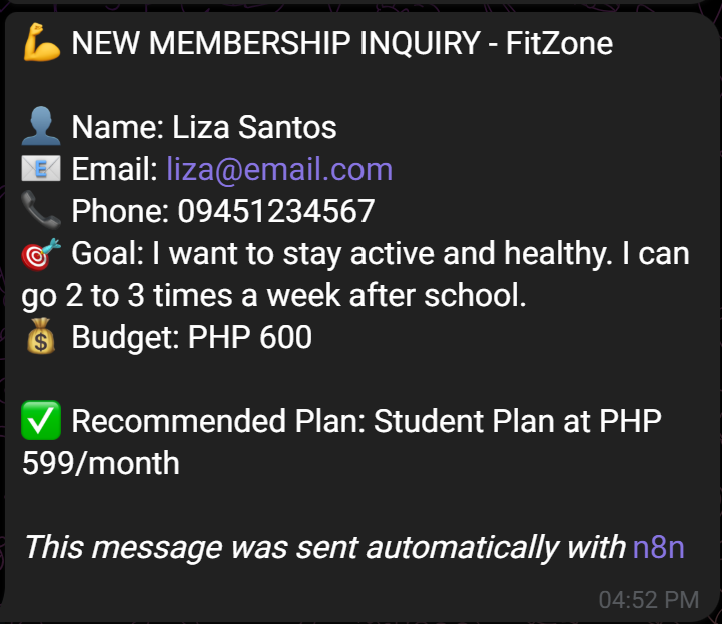
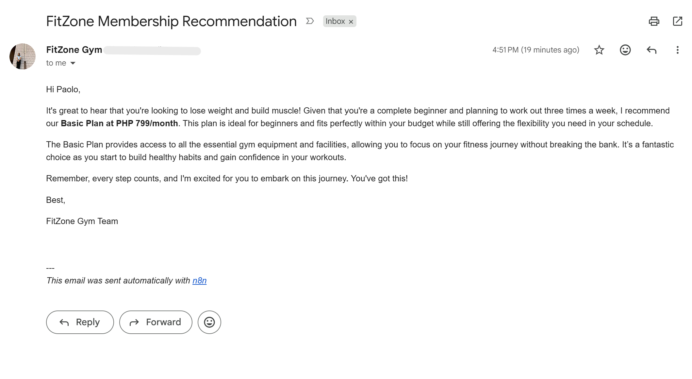
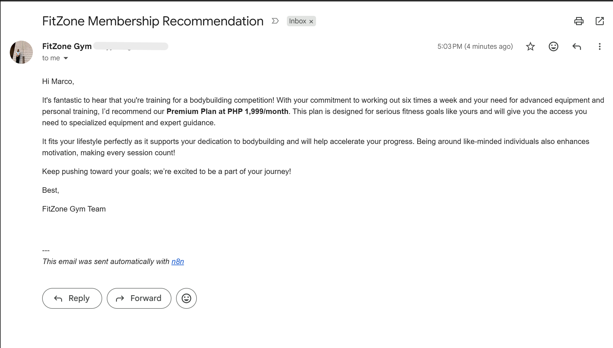
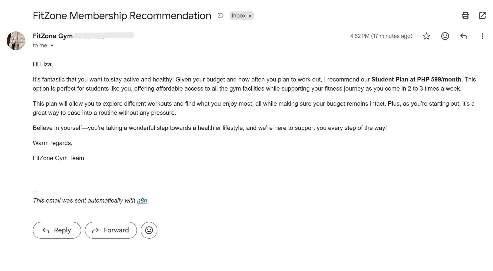
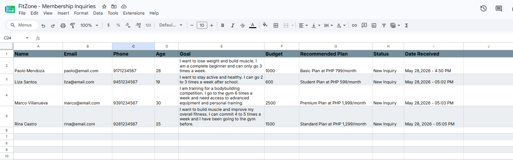

# 💪 FitZone Gym — AI-Powered Membership Recommendation System
### Built with n8n | OpenAI | Gmail | Telegram | Google Sheets

---

## 📌 Overview

FitZone is an intelligent membership inquiry automation system for gym businesses. When a potential member submits an inquiry, AI analyzes their fitness goals, budget, experience level, and lifestyle — then instantly recommends the right membership plan, sends a personalized email, notifies staff via Telegram, and logs everything to a live Google Sheets dashboard.

**No staff needed. No delays. Every inquiry handled perfectly, 24/7.**

---

## 🎯 The Problem

Gyms receive the same questions every single day:

- *"What membership is right for me?"*
- *"I want to lose weight — where do I start?"*
- *"I'm a beginner with a tight budget, what do you recommend?"*

Without automation, a staff member manually answers each inquiry — the same repetitive questions, over and over — pulling them away from actual members on the gym floor. Responses are delayed, inconsistent, and generic.

**The result: slower conversions, frustrated prospects, and wasted staff time.**

---

## ✅ The Solution

FitZone automates the entire inquiry-to-recommendation pipeline in seconds:

1. **Potential member submits** an inquiry form
2. **AI analyzes** their goals, budget, experience, and lifestyle
3. **Personalized recommendation email** sent instantly to the member
4. **Staff notified** via Telegram with full inquiry details
5. **Inquiry logged** to Google Sheets CRM automatically
6. **Webhook responds** with confirmation — workflow closes cleanly

---

## 🔄 Workflow Architecture

```
Member Submits Inquiry (Webhook)
        ↓
OpenAI — AI Membership Analysis & Recommendation
        ↓
Gmail — Personalized Recommendation Email → Member
        ↓
Telegram — Staff Notification with AI Recommendation
        ↓
Google Sheets — Log Inquiry to CRM Dashboard
        ↓
Respond to Webhook — Workflow Complete
```

---

## 🤖 AI Decision Logic

OpenAI analyzes each inquiry across 5 dimensions:

| Factor | What It Evaluates |
|--------|------------------|
| **Fitness Goals** | Weight loss, muscle building, general fitness, competition prep |
| **Experience Level** | Complete beginner, intermediate, advanced, competitive athlete |
| **Budget** | Monthly budget matched against plan pricing |
| **Commitment** | Training frequency (days per week) |
| **Student Status** | Eligibility for student discount |

The AI considers all factors together and recommends **exactly one plan** — with a personalized explanation tailored to that specific member's situation.

---

## 🏋️ Membership Plans

| Plan | Best For | Price |
|------|----------|-------|
| **Basic** | Beginners, light users, budget-conscious | PHP 799/month |
| **Standard** | Regular gym-goers, 3–5x weekly | PHP 1,299/month |
| **Premium** | Serious athletes, advanced training | PHP 1,999/month |
| **Student** | Students with valid ID | PHP 599/month |

---

## 📱 Telegram Notification

Staff receive instant notifications for every new inquiry:

```
💪 NEW MEMBERSHIP INQUIRY — FitZone Gym

👤 Name: Paolo Mendoza
📧 Email: paolo@email.com
📞 Phone: 09171234567
🎯 Goal: Lose weight and build muscle — complete beginner, 3x/week
💰 Budget: PHP 1,000/month

✅ AI Recommendation: Basic Plan — PHP 799/month
📋 Reason: Budget fits comfortably, beginner-friendly structure,
   3x/week commitment aligns with Basic access schedule.
```

---

## 📧 Email Sent to Member

Every member receives a personalized email — not a generic template:

```
Hi Paolo,

Thank you for your interest in FitZone Gym!

Based on your goals and situation, here is your 
personalized membership recommendation:

✅ We recommend our Basic Plan at PHP 799/month.

This plan is perfect for beginners like you who are 
starting their fitness journey. It gives you full 
gym access 3x per week — exactly matching your 
commitment level — while staying well within your 
PHP 1,000 budget.

As you progress and train more frequently, upgrading 
to Standard is always an option!

To get started, simply reply to this email or visit 
us at the gym. We'd love to have you!

FitZone Gym Team
```

---

## 📊 Google Sheets CRM

Every inquiry is automatically logged with full details:

| Column | Description |
|--------|-------------|
| Name | Member's full name |
| Email | Member's email address |
| Phone | Member's phone number |
| Age | Member's age |
| Goal | Their stated fitness goals |
| Budget | Monthly budget (PHP) |
| Student | Yes / No |
| Recommended Plan | AI-selected membership plan |
| Status | New Inquiry → Contacted → Enrolled |
| Date Received | Auto timestamp |

---

## 🧪 AI Accuracy — Test Scenarios

| Member Profile | AI Recommendation | Result |
|---------------|------------------|--------|
| Complete beginner, PHP 800 budget, 2x/week | Basic — PHP 799 | ✅ Correct |
| Regular gym-goer, PHP 1,500 budget, 4x/week | Standard — PHP 1,299 | ✅ Correct |
| Competitive athlete, PHP 2,500 budget, 6x/week | Premium — PHP 1,999 | ✅ Correct |
| Student, PHP 600 budget, valid school ID | Student — PHP 599 | ✅ Correct |

---

## 💼 Business Impact

| Metric | Before Automation | After Automation |
|--------|------------------|-----------------|
| Response time | Hours (manual) | Instant (24/7) |
| Staff time per inquiry | 5–10 minutes | Zero |
| Recommendation consistency | Varies by staff | 100% consistent |
| Inquiries outside business hours | Unanswered | Fully handled |
| Inquiry tracking | Scattered / none | Live CRM dashboard |

---

## 🧰 Tech Stack

| Tool | Purpose |
|------|---------|
| **n8n** | Workflow automation platform |
| **OpenAI GPT-4o Mini** | AI membership analysis & recommendation |
| **Gmail** | Personalized member emails |
| **Telegram** | Instant staff notifications |
| **Google Sheets** | CRM inquiry tracking |
| **Webhook** | Form submission trigger |

---

## 🗂️ Workflow Screenshots

### Main Workflow Canvas


### Telegram Staff Notification





### Personalized Email





### Google Sheets CRM


---

## 🚀 How to Deploy

1. Import `FitZone_Automation.json` into your n8n instance
2. Connect credentials: OpenAI, Gmail, Telegram, Google Sheets
3. Update your Google Sheets ID in the Sheets node
4. Update your Telegram Chat ID in the Telegram node
5. Update membership plan details in the OpenAI prompt if needed
6. Publish the workflow
7. Connect your inquiry form to the webhook URL

---

## 📋 Case Study

### Client: FitZone Gym (Fitness Industry)
### Challenge
FitZone's front desk staff spent 2–3 hours daily answering repetitive membership inquiries — mostly the same questions from prospects who needed guidance on which plan to choose. Responses were slow, inconsistent, and often delayed outside business hours, causing potential members to lose interest.

### Solution
An end-to-end AI inquiry automation system that captures every submission, analyzes the member's profile using GPT-4o Mini, and delivers a personalized recommendation instantly — without any staff involvement.

### Results
- ✅ Response time reduced from hours to **under 10 seconds**
- ✅ Staff saved **2–3 hours daily** on repetitive inquiries
- ✅ Inquiries handled **24/7** including nights and weekends
- ✅ Every member receives a **personalized recommendation** instead of a generic reply
- ✅ Management has **full visibility** of all inquiries in one dashboard

### Key Insight
The AI doesn't just match budget to price — it reads the full context of the member's message and crafts a recommendation that feels human. Members responded positively to receiving a detailed, tailored reply within seconds of submitting their form.

---

## 👩‍💼 Built By

**Alieza San Diego** — n8n Automation Specialist

Specializing in AI-powered workflow automation for fitness, retail, and service businesses.

---

## 📁 Related Projects

- [ShopFlow — AI E-commerce Order Management](https://github.com/alinglingg/shopflow-automation)
- [Premier Realty — CRM Pipeline & Lead Scoring](https://github.com/alinglingg/premier-realty-crm)

---

*Built with n8n — the most powerful open-source automation platform.*
